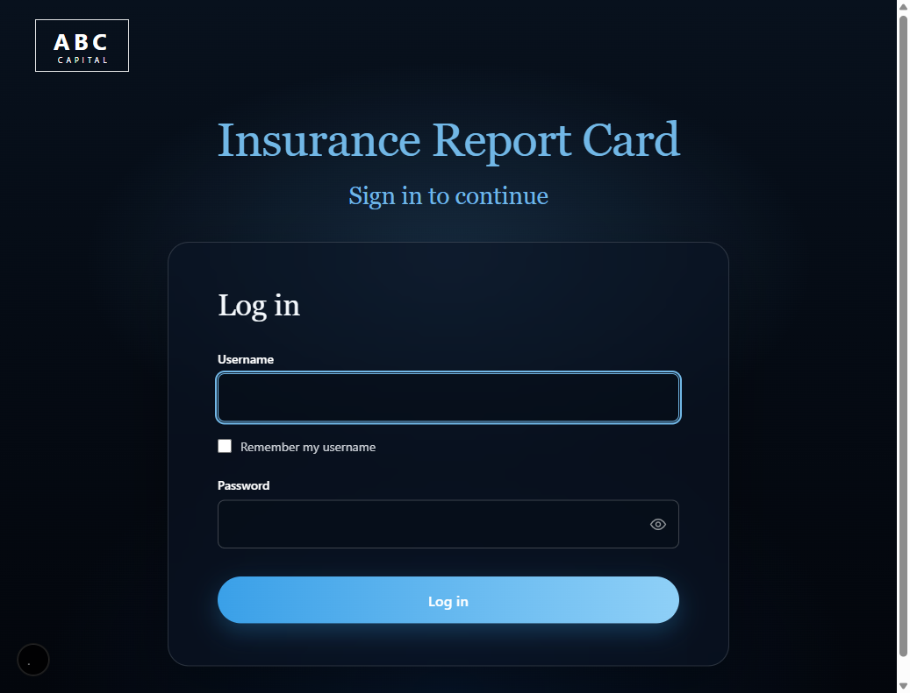
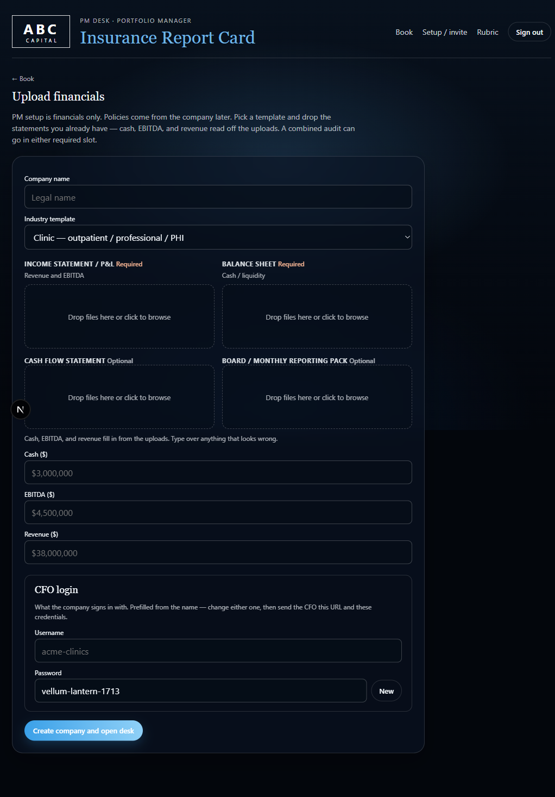
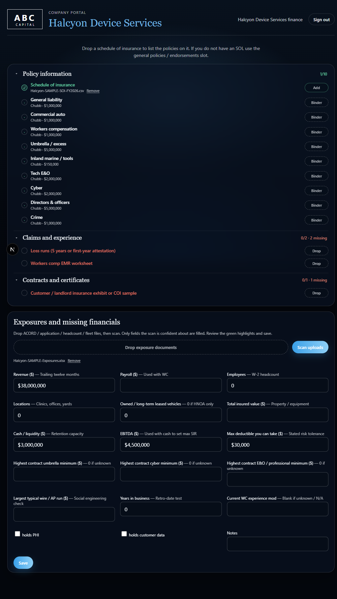
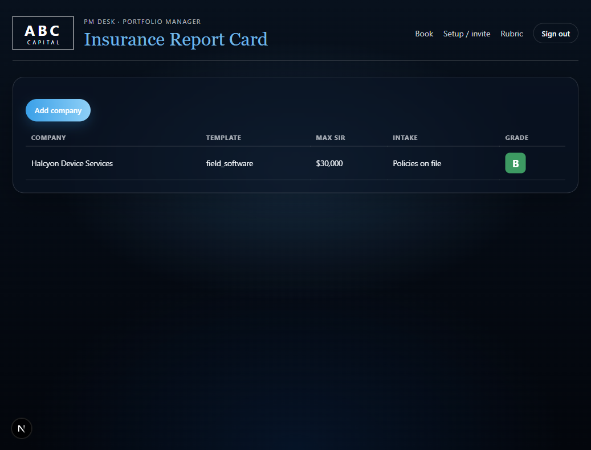
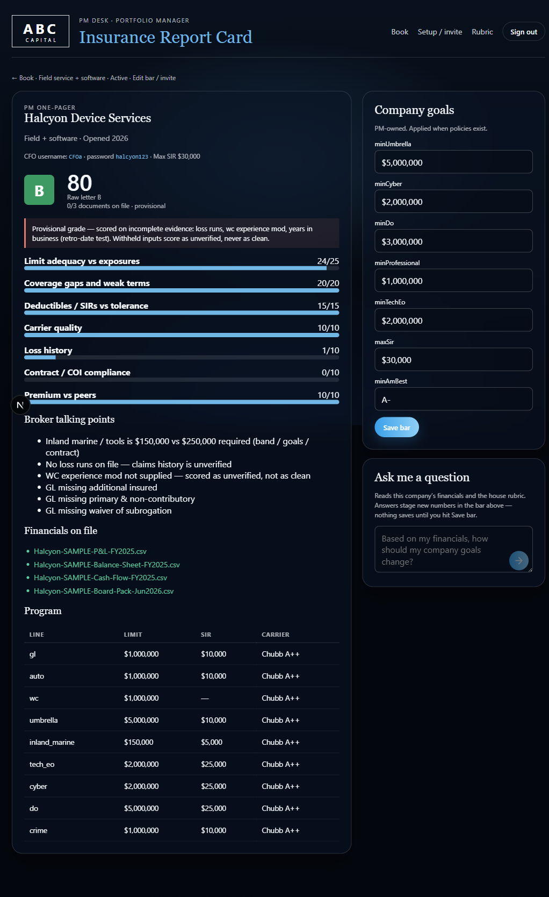
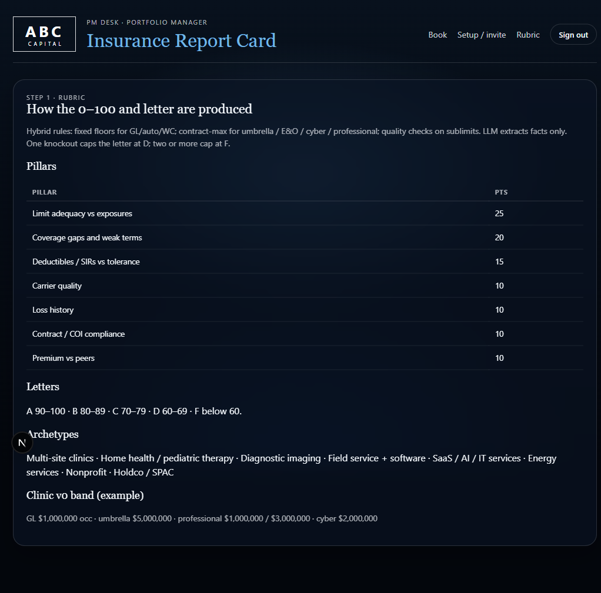
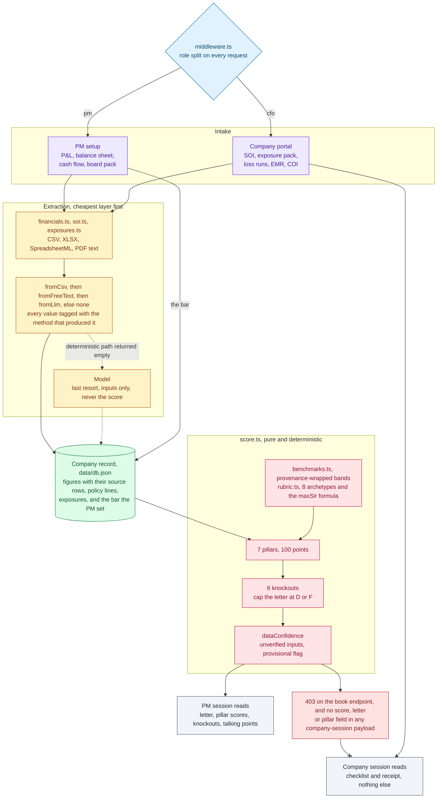

# Insurance Report Card

A desk that grades a private-equity book's commercial insurance programs on a
0–100 scale and hands the portfolio manager the points worth raising on
the next board call.

Two audiences sit on **one URL, one backend, two UIs**. A portfolio manager
creates a company by dropping its financial statements in and sets the bar
(cash / EBITDA / revenue, then limits and SIR) that feeds into the rubric. Then
the company's finance team signs in to the site created for them, prefilled with
what is required from them.

Runs entirely on your machine against a JSON file. No database, and no external
service unless you opt into the model calls. The scoring engine itself never
makes one.

```bash
npm install && npm run dev
```

---

## Walkthrough

One URL that leads to two desks. The screenshots below demonstrate the workflow
from company creation to receipt of letter grade. Here you follow a fictional
company: Halcyon Device Services, a field-service business with a software layer.

### 1. Two doors, one login



There is no separate company app. The portfolio manager and the portfolio company's
finance team sign in at the same address and the session decides what exists: the PM
gets a book, a rubric and a grade, the company gets a checklist. `middleware.ts`
enforces the split on every request, so a CFO session that types `/pm/halcyon`
straight into the address bar never reaches the route. The redirect happens before
the page renders, not after.

### 2. The PM creates the company



PM setup is financials only. Pick an industry template, drop in whatever statements
already exist, and `financials.ts` reads cash, EBITDA and revenue off them. The three
figures here ($3,000,000 cash, $4,500,000 EBITDA, $38,000,000 revenue) are parsed
rather than typed, and each one carries the row label and filename it came from, so
the autofill shows its work instead of dropping a number into a box.

Nothing about policies is asked for at this stage, because the PM does not have them.
The CFO credentials are minted here too, prefilled from the company name with a
generated passphrase. That URL plus those credentials is the whole handoff.

Max SIR is never typed. It falls out of the balance sheet:

```
maxSir  = clamp(min(1% cash, 5% EBITDA), $5k, ceiling)
```

$3M cash and $4.5M EBITDA give `min($30,000, $225,000)`. The liquidity test binds
tighter than the earnings test, so $30,000 is what appears on the desk.

### 3. The company fills the gaps, and never sees the grade



The finance team gets a receipt and a missing-items checklist. One schedule of
insurance was dropped in and `soi.ts` recognised **nine distinct policy lines** inside
it, each now showing its carrier and limit with a slot to attach the binder. Without
an SOI the same policies go into a general endorsements slot one at a time.

What is still outstanding is in red, and it is specific: loss runs, the workers-comp
EMR worksheet, a customer or landlord COI. Below that, an exposure pack has been
scanned and only the fields the parser was confident about are filled (revenue, cash,
EBITDA, max deductible), leaving TIV, contractual minimums and the experience mod
blank rather than guessed.

**There is no grade anywhere on this page, and no route that would show one.** The
book endpoint answers a company session with `403 PM only`, and the one company
endpoint a CFO can reach returns exposures, policies and documents with no score,
letter or pillar field in the payload at all. The grade is computed during the PM
page render and never crosses the wire. `/pm/...` typed into the address bar is
redirected by `middleware.ts` before the route runs.

That asymmetry is the design, not a permission oversight. The score is a diligence
artifact for the sponsor, not a report card handed to the company being diligenced.
A CFO who could see the letter would optimise against the rubric instead of sending
the documents, which is the same failure the withheld-data rule prevents one level
down.

### 4. The book



Once the company has filed, the book carries a letter. Every company sits on one
line: template, derived retention, what intake stage it is at, and the grade. With
fifteen companies this is the screen that says which board call needs a slide.

### 5. The letter comes back



**80, a B.** The two pillars that did not score are the ones worth reading.

Limit adequacy is 24/25 and coverage gaps 20/20, so the program itself is close to
right for the archetype. But **loss history is 1/10** and **contract / COI compliance
is 0/10**, and neither is a statement that this company has bad claims or bad
contracts. It is the engine refusing to score absent evidence as clean. The banner
says so directly, *scored on incomplete evidence... withheld inputs score as
unverified, never as clean*, and the run is stamped **provisional**.

That 1/10 is deliberate. An earlier version scored a missing WC experience mod at
7/10, which made silence the highest-scoring answer and gave a CFO a reason to stop
sending the worksheet. A reported mod of 1.25 now beats no mod at all.

The talking points underneath are the pillar scores stated out loud: inland marine at
$150,000 against a $250,000 requirement, no loss runs, GL missing additional insured,
primary & non-contributory, and waiver of subrogation. That is the broker
conversation, itemised.

On the right, the bar the PM set, and **Ask me a question**, which reads the
financials and the house rubric and proposes goal changes. Proposals are staged into
the form; nothing is written until Save bar is pressed, and the model is never allowed
near the score.

### 6. The rubric is inspectable



Seven pillars, their caps, the letter bands, and the eight archetypes, readable inside
the app. A grade nobody can audit is just a broker opinion with extra steps. The PM
can check the arithmetic here, and confirm that the same seven pillars produced every
other letter in the book.

---

## Architecture



Three things in that picture are the whole design.

**The model sits off to the side.** It is reachable only when a deterministic parser
returns empty, it writes into the company record, and there is no path from it to
`score.ts`. The grade is arithmetic over the record, so the same record always
produces the same letter.

**Every value carries the method that produced it.** A figure read off a clean CSV
and a figure a model inferred from PDF sludge are both numbers in the same field, and
the only thing that distinguishes them is the tag travelling alongside. Without it,
`dataConfidence` could not tell the PM which parts of a B are evidence.

**The grade stops at the engine.** It reaches a PM session and nothing else. That is
enforced at the endpoint rather than in the template, which is why the company portal
has no grade to hide.

## Why a rubric rather than a broker opinion

A broker's read on a program is one person's judgment, delivered verbally, and it
does not compare across a book. A rubric does three things that judgment doesn't:

- **It is deterministic.** `src/lib/score.ts` is pure over the company record, so
  the same inputs give the same letter every time. `npm run score:snapshot` pins the
  output so a rubric change that moves a grade shows up as a diff rather than a
  surprise.
- **It compares.** Fourteen companies scored on the same seven pillars rank
  against each other. One broker's memo about one company does not.
- **It separates "bad" from "unknown".** A program that looks clean because the
  CFO never sent the loss runs is not a clean program, and the engine refuses to
  score it as one.

## The seven pillars

| Pillar | Max | What moves it |
|---|---|---|
| **Limit adequacy vs exposures** | 25 | Per-line limit against `max(archetype band, PM goal, contractual minimum)`. Full credit at the requirement, 55% at half of it, 25% for a token limit, zero for absent. |
| **Coverage gaps and weak terms** | 20 | Starts at 20; −4 per required line missing. Also reads cyber sublimits: social-engineering below the larger of $250k or the company's largest wire, BI waiting periods over 12 hours. |
| **Deductibles / SIRs vs tolerance** | 15 | Retentions against the tolerance cap, graded by *how far* over: >3× tolerance drops to 4 points, >1.5× to 8. |
| **Carrier quality** | 10 | AM Best of the *weakest* carrier on the program, against the PM's floor. |
| **Loss history** | 10 | Split 4 evidence / 6 performance. See below. |
| **Contract / COI compliance** | 10 | Additional insured (4), primary & non-contributory (3), waiver of subrogation (3), evidenced on GL. |
| **Premium vs peers** | 10 | Total program premium as a share of revenue against the archetype band. |

90 / 80 / 70 / 60 for A / B / C / D.

### Knockouts cap the letter

Six conditions are not point deductions, because a program with one of them is
not a B-minus program. It is broken in a way arithmetic will paper over.

| Knockout | Trigger |
|---|---|
| No workers comp | Employees on payroll, not a holdco |
| No professional / malpractice | Clinic, home health, or imaging |
| No standalone cyber | Handles PHI or customer data |
| No auto or HNOA | Vehicles in use |
| Retro-date gap | Claims-made line whose retro date starts after the business did |
| Tower hole | Umbrella that does not attach to the primary |

One knockout floors the letter at **D**. Two floors it at **F**. The raw total is
still reported as `letterFromMath` alongside the capped letter, so the PM can see
both the arithmetic and the override.

### Withheld data must never outscore reported data

The claims pillar is the one place where naïve scoring creates a perverse
incentive, and it is worth being explicit about.

An earlier version scored a missing WC experience mod at 7 of 10, better than a
reported mod of 1.10. That makes silence the highest-scoring answer, and a CFO who
noticed would stop sending the worksheet. The pillar now splits: 4 points for
having loss runs on file at all, 6 for the mod itself, and an absent mod scores
**1** (3 where WC is not the economic exposure, such as SaaS, holdco, nonprofit). A
reported mod of 1.25 still beats no mod at all.

The same instinct runs through the cost pillar. Premium far *below* the peer band
does not score as efficiency. Spending 0.4% of revenue against a 2% band almost
always means lines or limits are missing, so it caps at 6 and flags.

### Data confidence sits next to the letter

Every run returns a `dataConfidence` block: documents received against documents
required, and the named list of inputs the engine had to treat as unverified. Those
are no policies extracted, no loss runs, no mod, no revenue, no cash or EBITDA, no
years in business. A run is marked **provisional** below 60% document coverage or
with three or more unverified inputs.

That is the difference between a clean B and a B resting on three guesses. Without
it the letter is more confident than the evidence behind it.

## Archetypes

The bar is not the same for a clinic chain and a SaaS company, so companies are
typed into eight archetypes that drive required lines, limit bands, default goals,
and the peer premium band.

`clinics` · `home_health` · `imaging` · `field_software` · `saas` · `energy` ·
`nonprofit` · `holdco`

The defaults encode the obvious asymmetries. A clinic needs professional and abuse
& molestation and a $1M/$3M med-mal tower; a SaaS company needs $5M cyber and tech
E&O and almost no umbrella, because E&O and cyber *are* the economic lines. A
holdco needs D&O and little else.

### Max SIR is derived, not typed

```
maxSir  = clamp(min(1% cash, 5% EBITDA), $5k, ceiling)
ceiling = $25k for clinic-like archetypes, $50k otherwise
```

A retention is a number the balance sheet has to absorb without flinching, so it
comes off the balance sheet rather than out of a preference. Both terms matter: 1%
of cash is the liquidity test, 5% of EBITDA the earnings test, and whichever binds
tighter wins.

## Benchmarks carry their own provenance

Every benchmark number in `src/data/benchmarks/*.json` is stamped with where it
came from and how far to trust it:

- **`sourced`**: read off a cited source and re-verified against it
- **`derived`**: computed from sourced inputs, or an engine convention
- **`estimated`**: practitioner judgment, defensible but not evidence

Nothing may be promoted to `sourced` without a `sourceUrl` that actually contains
the value, and `npm run benchmarks:check` enforces that and prints the split:

```
  archetype        total  sourced  derived  estimated
  ---------------------------------------------------
  clinics            29        0        2         27
  home_health        25        0        0         25
  ...
  ---------------------------------------------------
  TOTAL             167        0        4        163

  0.0% sourced
```

**That zero is the honest state of this repository today.** All 167 bands are v0
practitioner judgment. The plumbing to cite them exists and is validated; the
citations do not. Read any premium or limit band as a starting assumption, not a
market observation.

## Intake

The PM creates the company. The CFO fills the gaps. Nobody retypes a number that
appears in a document they already uploaded.

**Extraction is layered, and the cheap layer runs first.** `soi.ts` reads CSV,
XLSX (unzipping the sheet XML directly, no library), SpreadsheetML, and PDF text
streams, then matches line names through an alias table: `medmal`, `med-mal`,
`malpractice` and `professional` all resolve to `professional`; `HNOA` resolves
separately from `auto`, because the score treats them as one line but the program
does not.

`financials.ts` runs a priority-ordered rule table against statement rows, so "Net
program revenue" beats a bare "Revenue", plus a reject list for rows that look
right and are the wrong number: *EBITDA margin*, *deferred revenue*, *change in
cash*, *beginning cash*. It reads the `(in thousands)` / `(in millions)` header and
multiplies accordingly.

Both return the label and the source row behind each number, so the autofill shows
its work rather than dropping a figure into a box.

## Where a model is used, and where it isn't

**The score is never model-generated.** `score.ts` is pure arithmetic over the
company record, and every extraction prompt says *do not invent a score*. A model
touches inputs, never the grade.

Two different uses, with different failure modes:

**Extraction is a last resort, and says so.** `digestSoi` and `digestExposures`
both try the cheap deterministic path first and only reach for a model when it
comes back empty:

```
digestSoi:        fromCsv  →  fromFreeText  →  fromLlm  →  none
digestExposures:  fromText →  fromLlm (only if fewer than 2 fields landed)
```

Each returns the `method` that produced the answer (`csv`, `text`, `llm`, `none`),
so a number parsed off a clean CSV is distinguishable from one a model inferred
from PDF sludge. Uses `OPENAI_API_KEY` if set, falls back to `ANTHROPIC_API_KEY`,
and returns empty rather than throwing if neither is present.

**Advice is a first-class feature.** `POST /api/companies/[id]/advise` is the PM's
**Ask me a question** box. It hands Claude the company's financials, the bar as
currently set, the house rubric including the max-SIR formula and archetype bands,
and the policies on file, then asks for prose plus a structured goal proposal
validated against a Zod schema.

The interesting constraint there is `null`. Every goal field is nullable, and the
system prompt says to return null for anything it would leave alone. A model that
restates the current number to fill a field produces a diff the PM has to read and
dismiss; one that returns null produces no diff at all. Lines the company does not
run stay null, not zero.

Proposed numbers are **staged into the form**, never written. The PM still presses
save.

With no key set, `/advise` returns 503 and extraction quietly falls back to the
deterministic parsers. Scoring, the checklist and the CSV/XLSX paths are fully
offline.

## Running it

```bash
npm install
npm run dev
```

Or double-click `start.bat`, which installs on first run, detects an already-running
instance rather than failing on a port clash, and opens the browser once the server
answers. Either way the app is at **<http://localhost:9000>** (3000 is assumed taken).

Sign in at `/login`. The PM credentials are in `src/lib/auth.ts`; CFO credentials are
set by the PM on the Add company screen and are per-company.

```bash
npm run seed          # empty book, the normal starting state
npm run seed:sample   # three-company SAMPLE book
```

Optional, for the advise box and the extraction fallback:

```bash
cp .env.example .env.local    # then set ANTHROPIC_API_KEY (or OPENAI_API_KEY)
```

`/advise` requires `ANTHROPIC_API_KEY` specifically; extraction takes either and
prefers OpenAI when both are set. Restart the dev server after setting one, because
Next reads env at boot.

### Verification

```bash
npm run verify
```

Runs four things: `tsc --noEmit`, the benchmark provenance validator, the
financial-extraction check against the sample statements, and the scoring snapshot.
The snapshot is the one that matters. It re-scores a fixed book and diffs against
`scripts/scoring.snapshot.json`, so any rubric edit that moves a grade has to be
acknowledged rather than discovered later.

## Layout

```
src/
  lib/
    score.ts        the engine: pure, deterministic, 7 pillars + knockouts
    rubric.ts       pillars, letter map, archetype goals, max-SIR formula
    benchmarks.ts   provenance-wrapped bands; loads src/data/benchmarks/*.json
    benchmarks.validate.ts   refuses `sourced` without a real sourceUrl
    inputs.ts       required documents and exposure fields per archetype
    soi.ts          CSV / XLSX / SpreadsheetML / PDF text -> policy lines
    financials.ts   statement rows -> cash / EBITDA / revenue, with sources
    exposures.ts    exposure packs -> headcount, TIV, contractual minimums
    db.ts           data/db.json, read-modify-write
    auth.ts         login resolution; session.ts is the cookie
  app/
    pm/             desk: book, company detail, goals, rubric reference
    cfo/            portal: checklist, uploads, receipt, no grade
    api/            companies, documents, extract, advise, financials
  data/benchmarks/  line-bands · premium-bands · required-lines
scripts/            benchmark, financial, and scoring-snapshot checks
docs/               sample statement + schedule-of-insurance set for the demo
```

State lives in `data/db.json`, created empty on first API call. Uploads land in
`data/uploads/`. Both are gitignored; deleting `data/` resets everything.

## About the data

**Every company in this repository is invented, and so is every number attached
to one.** The fourteen companies in `src/lib/seed-data.ts` (Northbay, Halcyon,
Emberline, Lantern, Stillwater, Cedarpath, Riverbend, Vantage, Brightleaf,
Ironcreek, Claymore, Sendwell, ScholarLoop, TallyPort) are fictional, as are
their locations and industries. The sample statements under `docs/` are labelled
`SAMPLE, NOT LIVE FINANCIALS` in the files themselves.

This matters more than it might look. The seed book exists to exercise the rubric,
so it deliberately contains failing programs: a company graded **F**, two whose
arithmetic lands in the 90s but whose letter is floored to **D** by a knockout, a
1.41 experience mod, a tower with a hole in it. Those are claims no real business
should have invented and attached to its name. That is why no real business is
named anywhere in this repository, and why no contact, officer, or executive name
appears in the data at all.

Carrier names are real, since Chubb and its peers are public companies, and AM Best
ratings are public fact.

## Known limits

- **The benchmark bands are unsourced.** 0 of 167 values are `sourced`. The
  provenance system exists so this can be fixed incrementally; until it is, the
  premium and limit comparisons are judgment with a confidence label attached.
- **Authentication is demo-grade.** The session cookie is base64-encoded JSON with
  no signature, so it can be hand-edited into a PM session. It is `httpOnly` and
  `sameSite: lax`, which is enough for localhost and nowhere near enough for a
  deployed URL. Signing the cookie and hashing stored passwords are both
  prerequisites to hosting this anywhere.
- **PDF extraction is text-stream only.** `soi.ts` pulls `Tj` operators out of the
  raw PDF and falls back to printable-ASCII scraping. It handles a generated
  statement and will not handle a scan. CSV and XLSX are the reliable paths.
- **No policy-form reading.** The engine scores limits, retentions, carriers and
  endorsements as *recorded*. It does not read policy wording, so an exclusion
  that guts a line the engine counts as present is invisible to it.
- **Single-writer storage.** `data/db.json` is read-modify-write with no locking.
  One desk, one user at a time.
